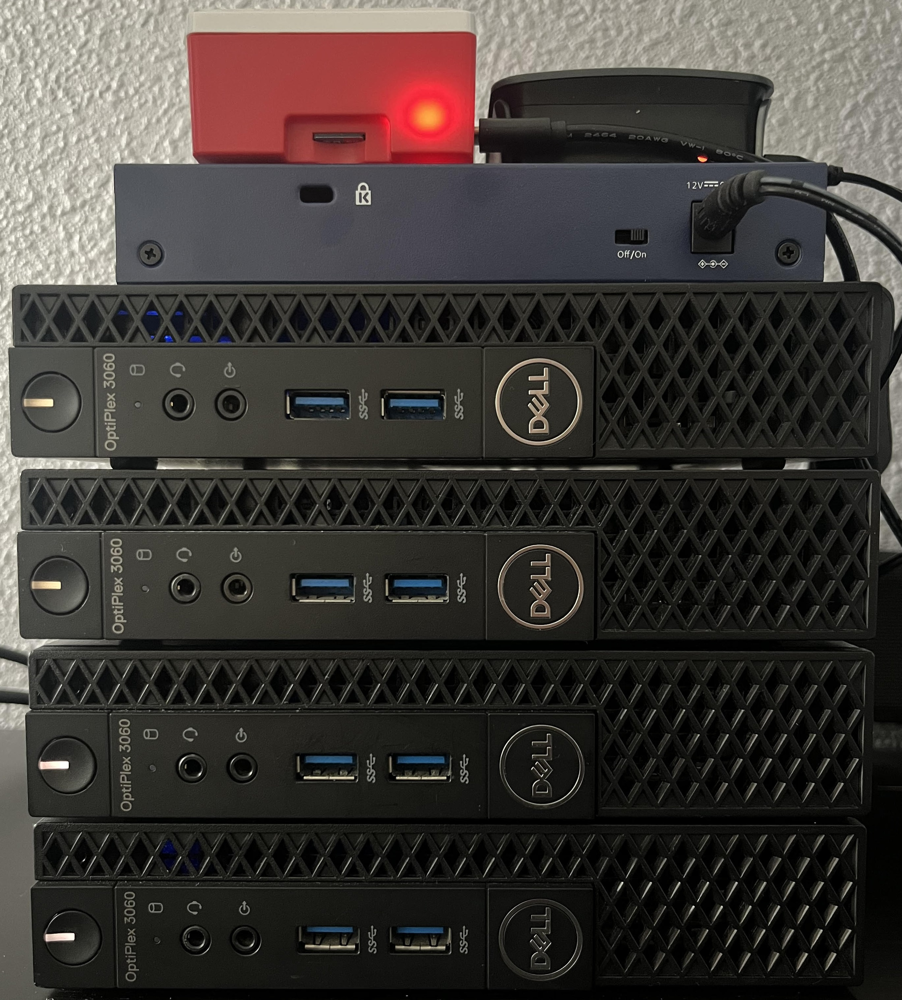
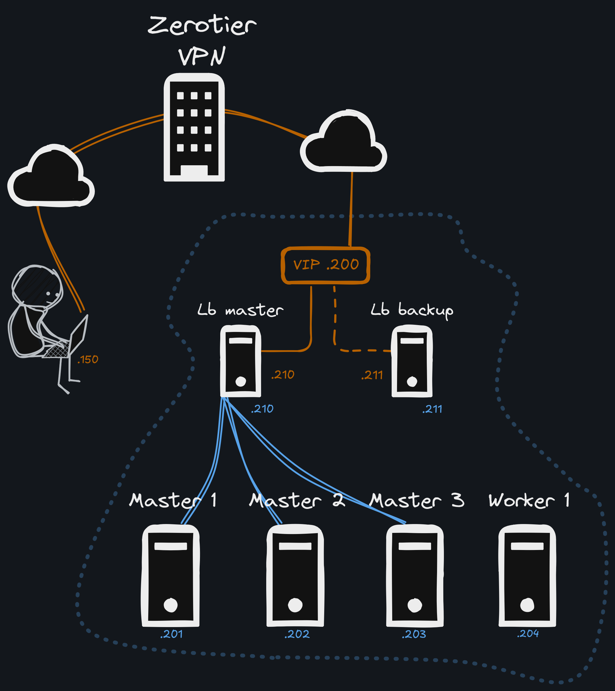

# minilab

The purpose of this repository is to track the evolution and architecture of my home lab. Its aim is to enable POCs to be carried out on technologies based around Kubernetes. 

I wanted to have a k8s cluster at home so I could play and test things. I wanted it to be highly available in terms of both applications and hardware. That's why I chose to buy 4 small workstations rather than a large virtualisation server. I imagine that this also allows me to benefit from good performance, but that remains to be proven.

## Hardware

- x4 Dell Optiplex 3060 MFF workstation
    - Ubuntu 22.04.4 LTS
- x1 Raspberry Pi 5
    - Debian GNU/Linux 12
- x1 Rasperry Pi 3
    - Debian GNU/Linux 12
- x1 8 Ports Ethernet Switch  NETGEAR GS108 
- x7 BrandRex 6A ethernet cable



## Architecture

My lab is not exposed to the internet via my home router. This avoids dependency on the home router and reduces the amount of network configuration.
To access it, I just need to connect my PC to my ZeroTier network. As the loadbalancers are also in the network, I have access to the API server (to administer my cluster) and the ingress (to consume its services).



## Repository

The sub-folders of this repository contain the configuration of the lab, POCs and services.

### Ansible

The [inventory.yml](./inventory.yml) file is based on environment variables. Before launching a playbook, I fill in the .env file based on the [.env.sample](.env.sample) template. 

Then, after sourcing my .env file, I can launch my playbooks :

```bash
source .env
ansible-playbook -i inventory.yml ./sub-folder/playbook.yml
```

#### Loadbalancers
The [loadbalancer](./loadbalancer) subfolder contains the configuration of my two loadbalancers.
- The playbook starts by installing and configuring HAProxy. It configures two different backends, one for the API server on port 6443 and the other for the cluster services on port 443. 

    *Nb: By default, k3s installs traefik, which exposes a loadbalancer service on all nodes' IPs.*

- It then installs Keepalived and configure it to expose a VIP in the ZeroTier network. A simple regex is used to detect the zerotier interface to use.

As Raspberry OS does not by default ask for the password to gain privileges, I can run the playbook as follows: 

```bash
source .env
ansible-playbook -i inventory.yml ./loadbalancer/playbook.yml
```
**To do :**
- [x] Configuring a backup and exhibiting a VIP in the ZeroTier network
- [ ] Integrate automatic connection to the ZeroTier network
- [ ] Containerise the two services and use docker-compose or another similar tool for deployment

#### K3S

The k3s folder allows me to uninstall and install k3s on my hosts at my request.
For the moment there is no particular configuration other than HA. 

- The playbook starts by initialising the cluster on the first master and immediately download the kubeconfig file
- Then it installs k3s in server mode on the other two
- Finally it installs k3s in agent mode on the last node
- The uninstall playbook uses the dedicated k3s script to uninstall the cluster

I create and kill my clusters with the following commands, using the -K option to specify the privilege escalation password : 

```bash
source .env
ansible-playbook -i inventory.yml ./k3s/install.yml -K
ansible-playbook -i inventory.yml ./k3s/uninstall.yml -K
```

I like this simple configuration because it allows me to distribute etcd and kube-api server on three nodes while still being able to run pods on my master nodes. For the little hardware and load I have, it's perfectly acceptable. 

**To do :**
- [x] Ensure HA and fully automated deployment
- [ ] Add a minimum of security by running CIS hardening scripts, for example.
- [ ] Add an ansible script for upgrading k8s and even the OS

### Go benchmark kube-api

As a little exercise to start learning go, I've created a [little tool](./go-benchmark-kube-api) to benchmark my kube api server.
For now it's fairly simple and contains the following functionality:
- [x] Select the number of requests per second
- [x] Select total execution time
- [x] Calculate the number of failed requests
- [x] Calculate the number of requests that throttle based on an abnormally long request time (>1s)
- [x] Calculate the average query time

We use go routines spaced by a ticker to launch the correct number of requests. 
The tool uses the default kubeconfig and is launched with the following command:
```bash
$: go run benchmark.go -rps 1 -duration 120
Benchmark finished!
Total number of requests sent: 120
Total number of failed requests: 0
Number of requests with throttling detected: 0
Average response time: 0.015539
```
For the moment, the results are not relevant because I'm blocked by a rate limit on the client side.
```bash
$: go run benchmark.go -rps 4 -duration 5
I0922 18:04:09.874384   43487 request.go:700] Waited for 1.000128103s due to client-side throttling, not priority and fairness, request: GET:https://<LB_IP>:6443/api/v1/nodes
Benchmark finished!
Total number of requests sent: 20
Total number of failed requests: 0
Number of requests with throttling detected: 1
Average response time: 0.209232
```
A good configuration of the client will allow me to bypass it.

### Helm stack

In this repo I keep my Helm Chart configuration.
I try to use the native helm controller of k3s to manage my charts in an elegant way. For the moment this stack is very basic but should be the big work of this project. We have:

- Longhorn to use workstation SSDs as persistent and distributed storage.
- Kube prometheus stack to have a base on which to add future monitoring. 
- An overconfiguration of traefik to make its dashboard accessible.

This project does not contain a dedicated DNS for the moment and ingress can be accessed by modifying the `/etc/hosts` file.
