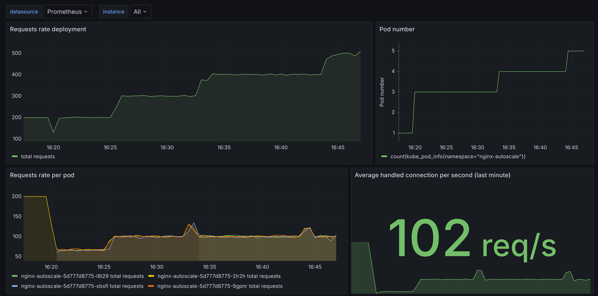

# Autoscaling POC 
To familiarise myself with autoscaling, I set up a small POC using the KEDA tool. The aim is to simulate a web server facing a variable load and to increase or decrease its number of replicas based on selected metrics.
KEDA fits in well with my current architecture because it allows me to base my autoscaling on prometheus metrics.

## Setting Up

First of all I had to simulate a more or less realistic environment. 
- In the  [manifests/nginx-autoscale.yaml](manifests/nginx-autoscale.yaml) file we configure bitnami's Nginx helm chart to deploy a replica, with a prometheus metric sidecar and a serviceMonitor that points to our prometheus metric instance.
    ```bash
    kubeclt apply -f manifests/nginx-autoscale.yaml
    ```
- The  [stresstest/](stresstest/) folder contains a [go script](stresstest/main.go) and a [Dockerfile](stresstest/Dockerfile) for deploying an image that will stress our nginx deployment with a defined number of requests per second. The following commands build the image and deploy it in the cluster (you can use the image directly from [dockerhub.com](https://hub.docker.com/r/nicogigi92/http-stress-test)).
    ```bash
    docker build stresstest -t http-stress-test:tagname
    kubectl apply -f manifests/stress-test.yaml
    ```
    The idea is to be able to control our load granularly, in particular by increasing or reducing the number of replicas.
    ```bash
    kubectl scale -n nginx-stresstest --replicas=2 deployment/http-stress-test
    ```

## KEDA

A helm chart allows you to install KEDA and it doesn't require [any special configuration](./manifests/keda.yaml) for a minimalist setup like mine. The interesting object is the [scaledOjbect](./manifests/scaled-object.yaml), which is used to configure autoscaling: 
- A fast cooldown because my setup isn't subject to erratic load variations
- We select our nginx deployment as the target for autoscaling
- KEDA is told to base its autoscaling on an irate of `nginx_http_requests_total` metric over the last 5 minutes
- A threshold of 100 rps is set to trigger autoscaling

KEDA and the scaledObject are installed as follows:
```bash
kubectl apply -f manifests/keda.yaml
# Wait for KEDA to be installed
kubectl apply -f manifest/scaled-object.yaml
```

The following image shows autoscaling in operation. When we vary the number of requests (by scaling our http-stress-test deployment) KEDA increases the number of replicas.
We can see that the load of requests processed per pod remains relatively constant thanks to this autoscaling. This is the expected result so that there is no drop in performance for the end client.


