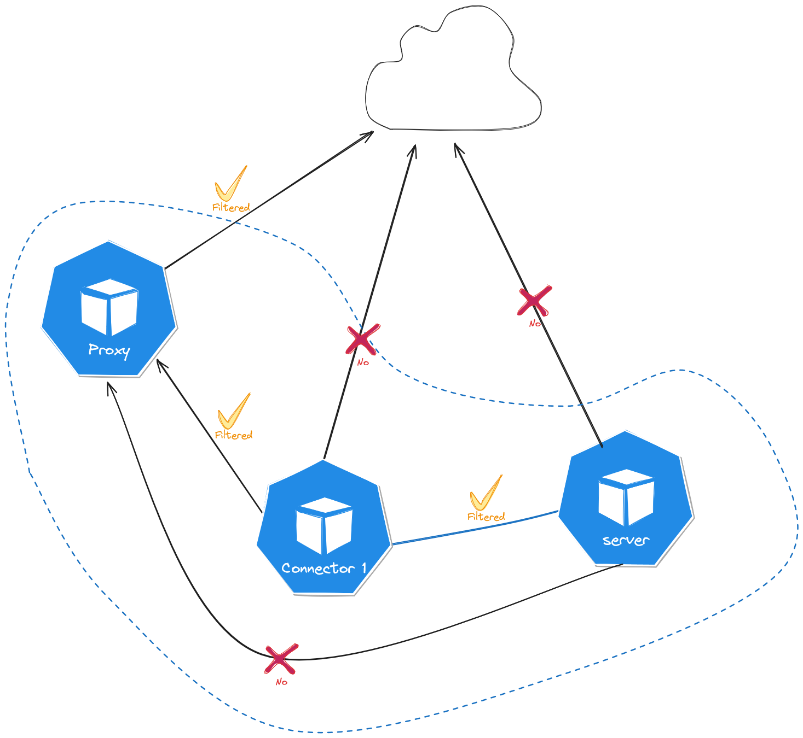

# Outband Proxy

This manifest allows deploying Envoy in forward proxy mode. The goal is to provide the cluster with a controlled outbound point to the internet. The advantage is being able to track who is making outgoing requests, where they are headed, and to act to prevent abuse. This implementation is minimalist and currently contains no security.

{ width=300px }
